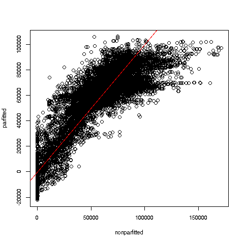
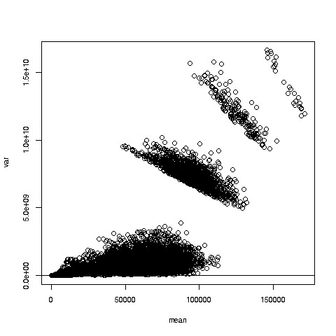

# regtools 

## Novel tools tools for linear, nonlinear and nonparametric regression.

These tools are associated with my book, <i>From Linear
Models to Machine Learning: Modern Statistical Regression and
Classification</i>, N. Matloff, CRC, 2017 (recipient of the
*Technometrics* Eric Ziegel Award for Best Book Reviewed in 2017).

*The tools are useful in general, independently of the book*.

## FEATURES:

* Tools for multiclass classification, parametric and nonparametric, any
  number of classes.  One vs. All and All vs. All paradigms.  Novel
adjustment for artificially balanced (or undesirably imbalanced) data.

* Innovative graphical tools for assessing fit in linear and nonlinear
  parametric models, via nonparametric methods.  Model evaluation,
examination of quadratic effects, investigation of nonhomogeneity of
variance.

* Nonparametric regression for general dimensions in predictor and
  response variables, using k-Nearest Neighbors (k-NN.  Local-linear
option to deal with edge aliasing.  Allows for user-specified smoothing
method.  Allows for accelerated exploration of multiple values of **k**
at once.  Tool to aid in choosing **k**.

* Nicer implementation of ridge regression, with more meaningful scaling
and better plotting.

* Extension to nonlinear parametric regression of Eicker-White
technique to handle heteroscedasticity.

* Misc. tools, e.g. Method of Moments estimation (including for
nonregression settings).

* Utilities for conversion of time series data to rectangular form,
  enabling lagged prediction by **lm** or other regression model.

* Linear regression, PCA and log-linear model estimation in missing-data
setting, via the Available Cases method.

* Utilities for conversion between factor and dummy variable forms,
  useful since among various regression packages, some use factors while
some others use dummies.

## EXAMPLE:  PARAMETRIC MODEL FIT ASSESSMENT

The fit assessment techniques in **regtools** gauge the fit of
parametric models by comparing to nonparametric ones.  Since the latter
are free of model bias, they are very useful in assessing the parametric
models.

Let's take a look at the included dataset **prgeng**, some Census data
for California engineers and programmers in the year 2000. The response
variable in this example is wage income, and the predictors are age,
gender, number of weeks worked, and dummy variables for MS and PhD
degrees.  You can read the details of the data by typing

``` r
> ?prgeng
```

One of the graphical functions for model fit assessment plots the
parametric (e.g. **lm()**) values against the nonparametric fit via
k-NN.  Let's try this on the Census data.

The package includes three versions of the dataset:  The original; a
version with categorical variables in dummy form; and a version with
categorical variables in R factor form.  Since the k-NN routines require
dummies, we'll use that second version, **peDumms**.

We need to generate the parametric and nonparametric fits, then call
**parvsnonparplot()**:

``` r
data(peDumms)
pe1 <- peDumms[c('age','educ.14','educ.16','sex.1','wageinc','wkswrkd')]
lmout <- lm(wageinc ~ .,data=pe1)
xd <- preprocessx(pe1[,-5],10)  # prep for k-NN, k <= 10
knnout <- knnest(pe1$wageinc,xd,10)
parvsnonparplot(lmout,knnout)
```



There is quite a bit suggested in this picture:

* There seems to be some overfitting near the low end, and quite
substantial underfitting at the high end.  

* There are intriguing "streaks" or "tails" of points, suggesting the
  possible existence of small but important subpopulations.  Moreover,
one can imagine seeing two separate large subpopulations

* There appear to be a number of people with 0 wage income. Depending on
the goals of our analysis, we might consider removing them.

Let's now check the classical assumption of homoscedasticity,
meaning that the conditional variance of Y given X is constant.  The
function <b>nonparvarplot()</b> plots the estimated conditional variance
against the estimated conditional mean, both computed nonparametrically:



Though we ran the plot thinking of the homoscedasticity assumption, this
is much more remarkable, confirming that there are interesting
subpopulations within this data.

The package includes various other graphical diagnostic functions.

By the way, violation of the homoscedasticity assumption won't
invalidate our estimates; they still will be *statistically consistent*.
But the standard errors we compute, and thus the statistical inference
we perform, will be affected.  This is correctible using the
Eicker-White procedure, which for linear models is available in the
**car** and **sandwich** packagers.  Our package here also extends this
to nonlinear parametric models, in our function <b>nlshc()</b> (the
validity of this extension is shown in the book).

## EXAMPLE; OVA VS. AVA IN MULTICLASS PROBLEMS

A very popular prediction method in 2-class problems is to use logistic
(logit) regression. In analyzing click-through patterns of Web users,
for instance, we have 2 classes, Click and Nonclick.  We might fit a
logistic model for Click, given user Web history, demographics and so
on.  Note that logit actually models probabilities, e.g. the probability
of Click given the predictor variables.

But the situation is much less simple in multiclass settings. Suppose
our application is recognition of hand-written digits (a famous machine
learning example). The predictor variables are pixel patterns in images.
There are two schools of thought on this:

* *One vs. All (OVA):*  We would run 10 logistic regression models,
  one for predicting '0' vs. non-'0', one for '1' vs. non-'1', and so
on.  For a particular image, we would thus obtain 10 estimated
probabilities.  Let i<sub>max</sub> be the image that yields the largest
probability; we would then guess the digit for the image to be 'i'.

* *All vs. All (AVA):*  Here we would run C(10,2) = 45 logit
analyses, one for each pair of digits.  There would be one for '0' vs.
'1', one for '0' vs. '2', etc., all the way up through '8' vs. '9'.
In each case there is a "winner" for our new image to be predicted, and
in the end we predict the new image to be whichever i has the most
winners.

Many in the machine learning literature recommend AVA over OVA, on the
grounds that there might be linearly separability (in the statistical
sense) in pairs but not otherwise.  My book counters by positing that
such a situation could be remedied under OVA by adding quadratic terms
to the logit models.

At any rate, the **regtools** package gives you a choice, OVA or AVA,
for both parametric and nonparametric methods.  For example,
**avalogtrn()** and **avalogpred()** do training and prediction
operations for logit with AVA.

Let's look at an example, again using the Census data from above.  We'll
predict occupation from age, sex, education (MS, PhD, other) wage income
and weeks worked.

``` r
data(peFactors) 
pef <- peFactors 
pef1 <- pef[,c('age','educ','sex','wageinc','wkswrkd','occ')] 
# "Y" must be in last column, class ID 0,1,2,...; convert from factor
pef1$occ <- as.numeric(pef1$occ) 
pef1$occ <- pef1$occ - 1
pef2 <- pef1 
# create the education dummy varibles
pef2$ms <- as.integer(pef2$educ == 14) 
pef2$phd <- as.integer(pef2$educ == 16) 
pef2$educ <- NULL 
pef2$sex <- as.integer(pef2$sex == 1) 
pef2 <- pef2[,c(1,2,3,4,6,7,5)] 
ovaout <- ovalogtrn(6,pef2) 
# estimated coefficients, one set per class
> ovaout
                  betahat       betahat       betahat       betahat
(Intercept) -9.411834e-01 -6.381329e-01 -2.579483e-01 -3.370758e+00
xage         9.090437e-03 -3.302790e-03 -2.205695e-02 -2.193359e-03
xsex        -5.187912e-01 -1.122531e-02 -9.802006e-03 -7.856923e-01
xwageinc    -6.741141e-06 -4.609168e-06  5.132813e-06 -4.076872e-06
xwkswrkd     5.058947e-03 -2.247113e-03  2.623924e-04  1.311084e-02
xms         -5.201286e-01 -4.272846e-01  5.280520e-01 -1.797544e-01
xphd        -3.302821e-01 -8.035287e-01  3.531951e-01 -3.883463e-01
                  betahat       betahat
(Intercept) -3.322356e+00 -4.456788e+00
xage        -1.206640e-02  3.323948e-02
xsex         5.173516e-01  1.175657e+00
xwageinc     2.033175e-06  1.831774e-06
xwkswrkd     5.517912e-04  2.794453e-03
xms          9.947253e-02  2.705293e-01
xphd         4.967115e-01  4.633907e-01
# predict the occupation of a woman, age 35, no MS/PhD, inc 60000, 52
# weeks worked
ovalogpred(ovaout,matrix(c(35,0,60000,52,0,0),nrow=1))
# outputs class 2, Census occupation code 102
```
